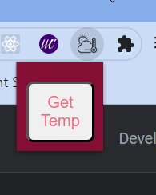
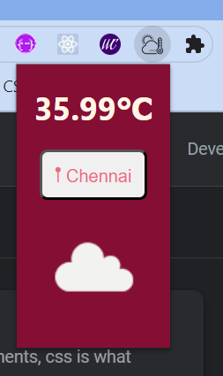

# ChromeExtension-Weather
This chrome extension makes it handy to get to know the temperature and what the weather's like. Also, there's no need to enter your location. It automatically gets it from your browser.
https://youtube.com/shorts/ELw3Wfjls0I?feature=share

# UserInterface

When we click then icon of this extension, we get

After clicking Get Temp, we get

# How I build it ?
The technologies used in building this Chrome extension were **HTML, CSS, and javascript**. It has a manifest.json file that gives information to the browser about the extension. 
Here, I used the **GeoLocation API** in Javascript which helps retrieve the current location of the device.
` navigator.geolocation.getCurrentPosition(success, error);`  is the line of code which when called requests the browser for the current location of the device.
I used the **BigDataCloud API** to get the address or the city name from the latitude and longitude retrieved earlier.
Then, I used the **OpenWeather API** for getting the weather in the current location.
Finally, I used the vanilla javascript to send this data to the respective elements in the HTML file.

# manifest.json file

{   
    "manifest_version": 3,
    "name": "℃",
    "version": "1.0.0",
    "description": "I'll tell you the temperature in your locality in a snap.",
    "author": "Sasi Shrilekhya",
    "action": {
        "default_popup": "index.html",
        "default_title": "℃",
        "default_icon": {
            "16": "temperature.png"
          }
    },
    "permissions": ["geolocation"]
    
}

